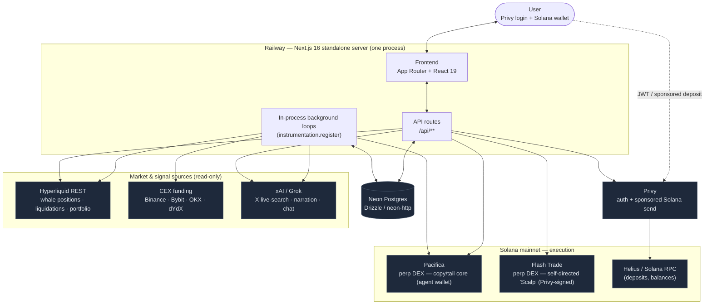
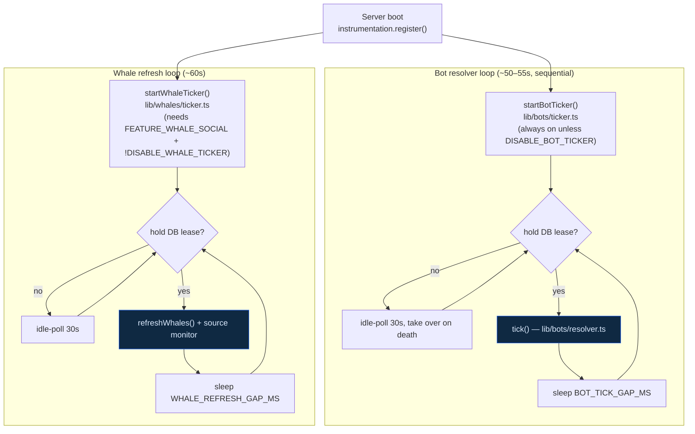
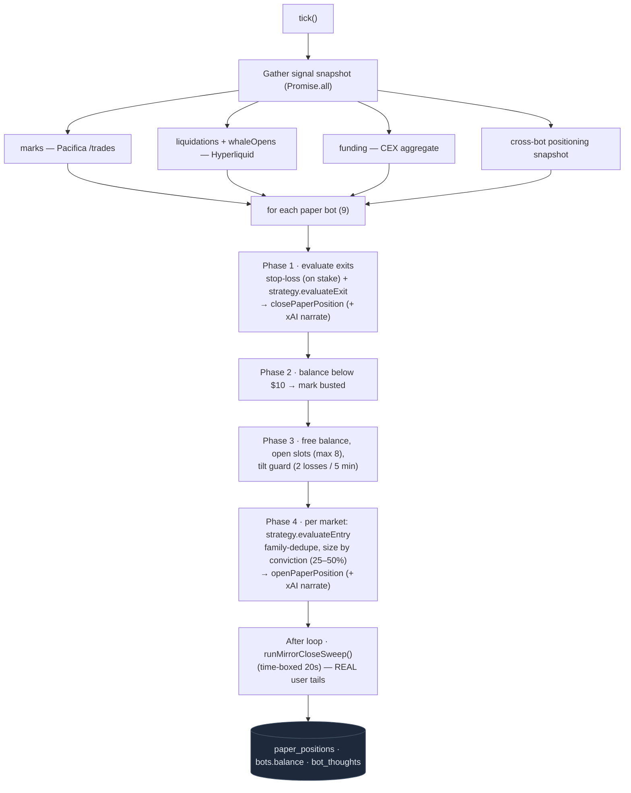
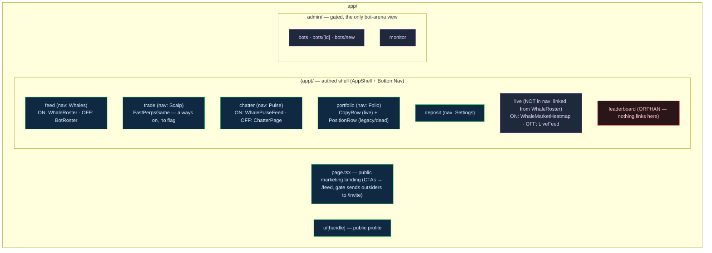
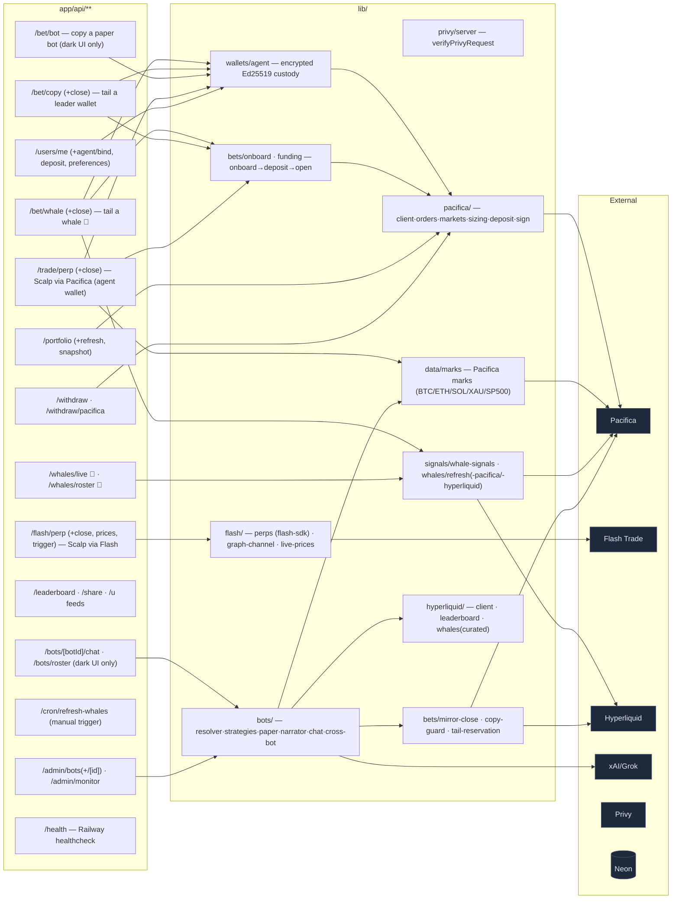
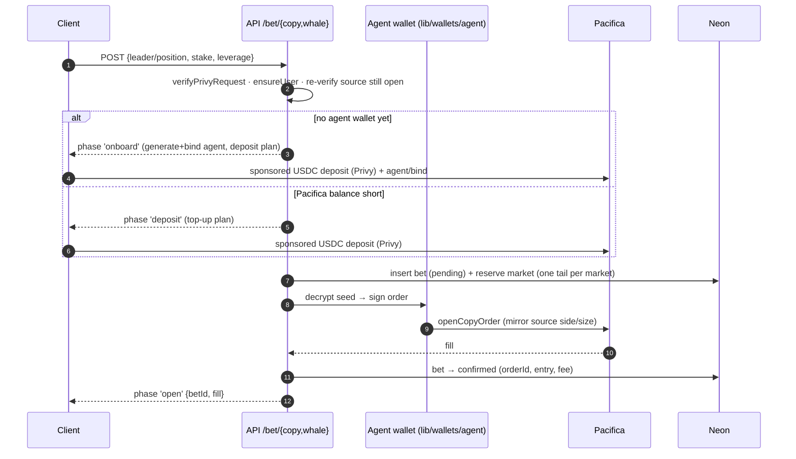
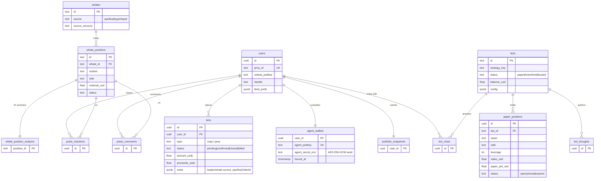

# Architecture — copy-perps (package: `breach`)

A system map of the app **as it exists in code today**, derived from the actual
source tree — not the original Fast Bet / gwak spec.

> ⚠️ **The root `CLAUDE.md` is stale.** The product pivoted from the 3-rail
> ("Meme / Prediction / Whale") TikTok feed to a **whale copy-trading app + a
> self-directed leverage "Scalp" game**, with an **AI paper-bot arena running
> headless behind the scenes**. What actually shipped:
>
> | CLAUDE.md says | Reality in code |
> |---|---|
> | Hosted on **Vercel**, `vercel.json` crons drive refresh | Hosted on **Railway** (`railway.json`, standalone `next start`). No `vercel.json` — refresh is driven by two **in-process lease-guarded loops** started from `instrumentation.ts`. |
> | Perp execution on **Flash Trade**; Drift dead | **Two venues.** **Pacifica** (Solana perp DEX) executes the copy-trading core server-side via a per-user agent wallet. **Flash Trade** (`flash-sdk`) powers the self-directed "Scalp" game, client-signed via Privy. **Drift** is gone. |
> | Meme (Jupiter swap) + Prediction rails | Both removed. No `signals` table, no Jupiter Prediction, no DexScreener. |
> | Privy embedded wallet signs every bet | Real tails execute via a per-user **agent wallet** (encrypted Ed25519 key) on Pacifica; Privy still does auth + the sponsored deposit send. |
> | — | New: **AI paper-bot arena** (9 bots on a tick loop), bot narration + chat via xAI/Grok, a Pulse/Chatter social layer. |
>
> There **is** a test runner now: `vitest` (`npm test`), despite CLAUDE.md saying none is configured.

---

## 0. TL;DR — what actually ships in the default config

With the default environment (`FEATURE_WHALE_SOCIAL` unset → **ON**), the live
user-facing product is exactly two things:

1. **Whale copy-trading** — browse real whale traders (Hyperliquid + Pacifica
   signal), then **tail/fade** their positions for real money on **Pacifica**
   (executed server-side via a per-user agent wallet). Surfaces: `/feed`,
   `/live`, `/chatter`, `/portfolio`.
2. **The "Scalp" game** — a 1-tap long/short leverage UI on **Flash Trade**,
   client-signed via Privy. Surface: `/trade`.

Everything else in the repo — **the entire AI bot-arena UI**, the legacy
betting rails, the leaderboard, the swipe feeds — is **built but not reachable**
in the default config (see §1). The bots still *run* server-side; users just
never see them.

---

## 1. ⭐ Feature flags — what is hidden behind what

**This is the section that resolves "is X actually live?".** There is exactly
**one** flag that changes what users see (`FEATURE_WHALE_SOCIAL`); three more
flags are **defined but dead** (zero call sites); two client flags gate small
dev/onboarding bits; and three `DISABLE_*` env vars are ops kill-switches for
the background loops.

### 1a. The one flag that matters: `FEATURE_WHALE_SOCIAL`

- Helper: `whaleSocialEnabled()` in [lib/features.ts](../lib/features.ts).
- Logic: `process.env.FEATURE_WHALE_SOCIAL !== "false"` → **default ON**. The
  only way to get the legacy bot UI is to *explicitly* set it to `"false"`.
- **7 call sites**, each flipping a whole surface:

| Call site | `ON` (default) renders/allows | `OFF` (`="false"`) renders/allows |
|---|---|---|
| [app/(app)/feed/page.tsx:13](../app/%28app%29/feed/page.tsx) | `WhaleRoster` (whale list + tail) | `BotRoster` (legacy bot scoreboard) |
| [app/(app)/live/page.tsx:20](../app/%28app%29/live/page.tsx) | `WhaleMarketHeatmap` (or `WhaleLiveFeed` at `?mode=swipe`) | `LiveFeed` (bot swipe feed) |
| [app/(app)/chatter/page.tsx:129](../app/%28app%29/chatter/page.tsx) | `WhalePulseFeed` (whale opens/closes) | legacy `ChatterPage` (bot narration stream) |
| [app/api/whales/live/route.ts:9](../app/api/whales/live/route.ts) | serves whale position signals | **404** |
| [app/api/whales/roster/route.ts:16](../app/api/whales/roster/route.ts) | serves whale trader roster | **404** |
| [app/api/bet/whale/route.ts:350](../app/api/bet/whale/route.ts) | **real tailing works** (open/close on Pacifica) | **404** — copy-trading is off |
| [lib/whales/ticker.ts:28](../lib/whales/ticker.ts) | whale refresh loop + source monitor start | whale loop **never starts** (no fresh whale data) |

**Consequence:** the flag is effectively the master switch between the **whale
copy-trading product** (ON) and the **legacy bot-arena product** (OFF). They are
mutually exclusive — you never see both. In production it is **ON**, so the bot
UI and `/api/bet/bot` are dark.

### 1b. The bot arena: running, but invisible to users

The **bot resolver loop is NOT gated by `FEATURE_WHALE_SOCIAL`.** Compare the two
ticker entry points: `startWhaleTicker()` has an
`if (!whaleSocialEnabled()) return;` guard ([lib/whales/ticker.ts:28](../lib/whales/ticker.ts)),
while `startBotTicker()` has **no such guard** ([lib/bots/ticker.ts:50](../lib/bots/ticker.ts)) —
only `DISABLE_BOT_TICKER` stops it. So the bot loop starts in every config. This
matters because the resolver tick also drives `runMirrorCloseSweep()`, which
closes **real** user tail positions ([lib/bots/resolver.ts:301](../lib/bots/resolver.ts)),
so it has to keep running even when the bot *UI* is dark.

So in the default (whaleSocial **ON**) config:

- ✅ The 9 bots **tick every ~50s**, open/close **paper** positions, update
  balances, and **call Grok to narrate** every trade ([lib/bots/narrator.ts](../lib/bots/narrator.ts)).
- ✅ The same tick runs `runMirrorCloseSweep()` — **real-money** auto-close of
  user tails whose source went flat ([lib/bets/mirror-close.ts](../lib/bets/mirror-close.ts)).
- ❌ **No user-facing page renders any of it.** `BotRoster`, `LiveFeed`,
  `LiveFeedDesktop`, `BotChatSheet`, `/api/bots/roster`, `/api/bots/[id]/chat`,
  and `/api/bet/bot` all sit on the whaleSocial-OFF path or are simply unlinked.
  The only human view is **`/admin/bots`** and **`/admin/monitor`**.

> **Net:** the bot arena is **backstage infrastructure + signal**, not a shipped
> user feature. It also burns xAI tokens narrating trades nobody sees. Before
> retiring it, note the real-money `runMirrorCloseSweep()` dependency (a second,
> event-driven caller exists in [lib/whales/source-monitor.ts:300](../lib/whales/source-monitor.ts) —
> verify it fully covers the close cases before cutting the bot tick).

### 1c. Dead flags — defined, referenced nowhere

These exist in [lib/features.ts](../lib/features.ts) but have **zero call sites**
outside their own definition and tests. They gate nothing; setting them has no
effect.

| Helper | Env var | Status |
|---|---|---|
| `copyTradeEnabled()` | `FEATURE_COPY_TRADE` | **dead** (0 call sites) |
| `legacyRailsEnabled()` | `FEATURE_LEGACY_RAILS` | **dead** (0 call sites) |
| `casinoModeEnabled()` | `FEATURE_CASINO_MODE` | **dead** (0 call sites) |

### 1d. Client flags (`NEXT_PUBLIC_*`) — small dev/onboarding toggles

From [lib/client-features.ts](../lib/client-features.ts); both **default OFF**
(`=== "true"`):

| Helper | Env var | Gates |
|---|---|---|
| `depositDevToolsVisible()` | `NEXT_PUBLIC_FEATURE_DEPOSIT_DEV_TOOLS` | the jupUSD→USDC dev converter on [app/(app)/deposit/page.tsx:47](../app/%28app%29/deposit/page.tsx) |
| `feedRailPrefsVisible()` | `NEXT_PUBLIC_FEATURE_FEED_RAIL_PREFS` | the feed-rail toggle UI — deposit page + [components/onboarding/PreferencesProvider.tsx:40](../components/onboarding/PreferencesProvider.tsx) |

### 1e. Legacy flag: `FEATURE_GASLESS_BETS`

- Read at [app/api/withdraw/route.ts:91](../app/api/withdraw/route.ts) via a
  local `sponsorWithdrawals()` helper: `=== "true"` → **default OFF**.
- When ON, withdrawals are built gas-sponsored (gas wallet as fee payer). Legacy
  path tied to the old rails; off in the current product.

### 1f. Ops kill-switches (not feature flags — operational toggles)

These stop the background loops; default unset → loop runs.

| Env var | Effect | Default |
|---|---|---|
| `DISABLE_BOT_TICKER` | bot resolver loop never starts ([lib/bots/ticker.ts:50](../lib/bots/ticker.ts)) | runs |
| `DISABLE_WHALE_TICKER` | whale refresh loop never starts ([lib/whales/ticker.ts:24](../lib/whales/ticker.ts)) | runs *(if whaleSocial ON)* |
| `DISABLE_WHALE_SOURCE_MONITOR` | the websocket source monitor inside the whale loop never starts ([lib/whales/source-monitor.ts:338](../lib/whales/source-monitor.ts)) | runs |

Tuning knobs (numeric, not on/off): `BOT_TICK_GAP_MS`, `WHALE_REFRESH_GAP_MS`,
`WHALE_ROSTER_LIMIT`, `WHALE_ROSTER_OPEN_POSITIONS`, `WHALE_ROSTER_PNL_POINTS`,
`WHALE_SOURCE_ACCOUNTS_PER_SOCKET`, `WHALE_SOURCE_RECONCILE_DELAY_MS`.

### 1g. Built-but-unreached, independent of any flag

Not flag-gated — just orphaned wiring:

- **`/leaderboard`** — full page exists, but **nothing links to it** (not in nav,
  no `href`, no redirect).
- **`/live`** — not a nav tab; reachable only via two links inside `WhaleRoster`.
- **`WhaleLiveFeed`** (swipe view) — only at `/live?mode=swipe`.
- **Legacy portfolio rows** — `PositionRow` / `CloseButton` still POST to the
  removed `/api/bet/{meme,prediction,perp}` rails (dead paths beside live `CopyRow`).

---

## 2. System context

---

## 3. Runtime / process model — the key architectural fact

There is **no external scheduler**. On boot, `instrumentation.ts → register()`
starts two self-healing loops in the same Node process. A **DB lease** ensures
exactly one process ticks even though dev + prod share one database.

- **Lease-guarded** (`ticker-lease.ts`): whoever holds the row ticks; others stand by and take over if the holder dies.
- **Sequential** bot ticks: one fully finishes before the next → no duplicate-position race.
- **Self-healing**: a thrown tick is logged; the loop never dies.
- **Gating differs by loop** (see §1f): the **bot** loop runs in *every* config
  (it carries real-money mirror-close); the **whale** loop only runs when
  `FEATURE_WHALE_SOCIAL` is on.

---

## 4. The bot resolver tick (what each tick does)

> **Reminder (see §1b):** none of this is shown to users in the default config.
> The bots run headless. The tick is kept alive because it *also* runs the
> real-money `runMirrorCloseSweep()`.

9 registered bots ([lib/bots/index.ts](../lib/bots/index.ts)) run strategies
against a shared signal snapshot; closes/opens are **paper** (DB only). The same
tick also force-closes **real** user tails whose source went flat.

**Roster (9):** `Whale` · `Orca` · `Leviathan` · `Megalodon` (each mirrors a
bundle of 3 curated whales) · `Pulse` (Grok + X live-search) · `Bullion` (4h gold
mean-reversion) · `Atlas` (overnight SP500 drift) · `Blitz` (15m crypto momentum)
· `Tilt` (degen revenge). Admin can clone variants at runtime
(`/api/admin/bots` → `registerBotDynamic`).

---

## 5. Frontend surfaces (annotated by flag)

Real nav = **5 tabs** ([components/shell/nav-items.ts](../components/shell/nav-items.ts) +
[BottomNav.tsx](../components/shell/BottomNav.tsx)): **Whales · Scalp · Pulse ·
Folio · Settings**. Each flag-branching page is marked below.

- **Green** = live in the default (whaleSocial ON) config.
- **Purple** = reachable but off the main nav / admin-only.
- **Red** = orphaned (no link reaches it).
- The bot-arena components (`BotRoster`, `LiveFeed`, `BotChatSheet`, etc.) render
  only on each page's **OFF branch** → never in the default config.

Tail entry is the shared `TailModal` ([components/tail/TailModal.tsx](../components/tail/TailModal.tsx)),
rendered from the whale surfaces; its `TailSource` is a `kind: "whale" | "bot"`
union ([components/tail/tail-types.ts](../components/tail/tail-types.ts)), but the
`"bot"` arm is only reachable from the dark bot UI.

---

## 6. API routes ↔ domain libs ↔ externals

Routes that **404 when `FEATURE_WHALE_SOCIAL` is off** are marked 🐋.

---

## 7. Real-money copy / tail lifecycle (Pacifica)

Trades are **server-executed** through a per-user **agent wallet** — an Ed25519
key whose seed is AES-256-GCM encrypted in `agent_wallets` and bound to the
user's Pacifica account. The route returns multi-phase responses; the client
signs only the funding (deposit) tx via Privy **sponsored** send.

**Auto-close (mirror-close sweep):** for every confirmed `copy`/`whale` bet,
group by leader wallet / bot id / whale source; if the source has gone flat,
submit a reduce-only close on Pacifica and record realized PnL. Three close
paths: `closeLeaderFollowers`, `closeBotFollowers`, `closeWhaleFollowers`
([lib/bets/mirror-close.ts](../lib/bets/mirror-close.ts)). Invoked from **two
places**: the bot resolver tick ([lib/bots/resolver.ts:301](../lib/bots/resolver.ts))
and the event-driven whale source monitor
([lib/whales/source-monitor.ts:300](../lib/whales/source-monitor.ts)).

**Flash tail persistence (June 2026):** Flash tails are no longer write-less.
`TailModal` sends whale/bot lineage in the `/api/flash/perp` body; the route
records a `flash-tail` bets row (meta in
[lib/bets/flash-tail-meta.ts](../lib/bets/flash-tail-meta.ts), lifecycle in
[lib/bets/flash-tail.ts](../lib/bets/flash-tail.ts)); the client confirms via
`/api/flash/perp/confirm` and `/api/flash/perp/close/confirm`. Every open/close
also writes a `fills` row (`quote-estimate` at confirm time). The portfolio
attributes live Flash positions back to their bet by (market, side), so tail
rows survive reload with whale/bot names + betId. A reconcile sweep
([lib/bets/flash-reconcile.ts](../lib/bets/flash-reconcile.ts)) rides the whale
ticker tick: reaps stale pendings, verifies signatures on-chain, upgrades
estimate fills/proceeds to chain truth via USDC balance deltas, reverts failed
closes, and kills failed opens — including opens whose signature never becomes
findable within 30 min (dropped tx; they'd otherwise retry forever). A liveness
pass then expires confirmed tails whose chain-verified position no longer shows
in `positionsOf` (liquidation, TP/SL trigger, lost close postback) to status
`closed-external` with `closeReason: 'external'` — no proceeds or fill is
fabricated; the portfolio renders them as closed history with unknown PnL.
Scalp-game trades (no lineage) are untouched.

---

## 8. Database (Drizzle / Neon)

Plus a singleton `thought_settings` row, runtime-created **lease tables** (bot +
whale tickers), and a `waitlist`. `bets.signal_id` is a soft pointer — no FK.

---

## Legend

- **Solid** = data/control flow · **dotted** = auth/verification side-calls.
- Two execution venues: **Pacifica** (copy/tail core, server-signed via agent
  wallet) and **Flash Trade** (`flash-sdk`, self-directed "Scalp", Privy-signed).
  **Drift** is gone.
- **Hyperliquid** is read-only signal intelligence. **xAI/Grok** drives bot
  narration, chat, and the Pulse strategy's X live-search.
- Bot trades are **paper** (`paper_positions`) and **invisible to users in the
  default config**; user copy/tail trades are **real** (`bets` → Pacifica).
- The arena runs on **in-process lease-guarded loops**, not external cron.
- **Flag reality (§1):** `FEATURE_WHALE_SOCIAL` (default ON) is the only flag
  that changes what users see; `FEATURE_COPY_TRADE` / `FEATURE_LEGACY_RAILS` /
  `FEATURE_CASINO_MODE` are dead.
